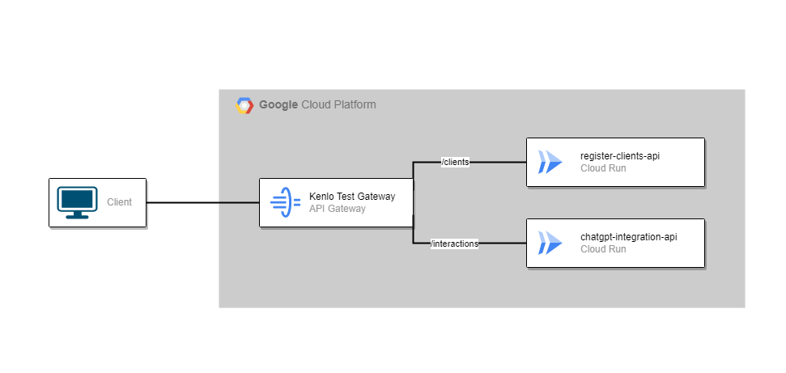

# kenlo-register-client-api

Esta documentação pertence a um dos projetos do teste para a vaga de Pessoa desenvolvedora Back-end. Especificamente o **Desafio 1** (**API1**)

## Sobre o Desafio

**API1** - Realiza um cadastro inicial de um possível cliente e armazena em um banco de dados noSQL

**API2** - Interage com uma única pergunta do usuário em uma integração com ChatGPT e armazena na mesma collection onde se encontra os dados do cliente

### Requisitos

✅ Seu serviço deve ser acessível através de uma API REST 

✅ Você deverá desenvolver 2 APIs 

✅ Seu serviço deve validar os dados de entrada

✅ Os dados coletados para cadastro são: nome, email e telefone

✅ Seu serviço deve utilizar um banco noSQL

✅ Integrado ao ChatGPT (documentação)

✅ Aconselhado utilizar containers para o desenvolvimento (Docker)

✅ Disponibilizar os serviços Online

### Requisitos adicionais

✅Boas práticas de desenvolvimento

✅Padrões de codificação

✅Execução utilizando docker

✅Readme bem estruturado explicando a arquitetura e instruções para subir os microserviços

✅Código no GitHub, demonstrando conhecimento em sua utilização

✅Swagger

✅Teste unitário e teste de integração

✅CI/CD

## Arquitetura 

A arquitetura está distribuida da seguinte forma:



Ambas as APIs isoladas que podem ser acessadas a partir de um API Gateway. 

Ao acessar o endpoint **_/clients_** o redirecionamento será para a API de registro de clientes

Utilizando o endpoint **_/interactions_** o redirecionamento será para a API de interação com o ChatGPT cujo endpoint interno é **_/questions_**

## Sobre a API

Uma API que recebe dados de potenciais clientes e armazena em um banco de dados NoSQL (MongoDB)

### Referência

URL do gateway: https://kenlo-test-api-gateway-7vbw2aqt.uc.gateway.dev

### **Listar todos os potenciais clientes**

<br>

```http
  GET /clients
```

### **Cadastrar potenciais clientes**

<br>

```http
  POST /clients
```

JSON Body

```json
  {
	  "name": "ExampleName",
	  "email": "example@email.com",
	  "phoneNumber": "5513911223344"
  }
```

| Campo         | Tipo     | Descrição                                           |
| :------------ | :------- | :---------------------------------------------------|
| `name`        | `string` | **Required**. Nome do cliente                       |
| `email`       | `string` | **Required**. Email do cliente                      |
| `phoneNumber` | `string` | **Required**. Numero de telefone do cliente         |

O campo phoneNumber deve obedecer a seguinte regex: 

`/^(?:(?:\+|00)?(55)\s?)?(?:\(?([1-9][0-9])\)?\s?)?(?:((?:9\d|[2-9])\d{3})\-?(\d{4}))$/`

Algumas das possíveis entradas:

- 551399886-1122
- +55 (11) 91122-3344
- +55 1191122-3344
- 55(13)91122-3344
- 5513911223344
- 13997763344
- 13 911223344
- (13) 1122-3344

### Como rodar localmente

Para rodar a API localmente com mais facilidade, é recomendada a instalação do _docker_.

- Clone o repositório com o comando `git clone https://github.com/luisdurante/kenlo-register-client-api.git`
- Instale as dependências com `npm install`
- Na raiz do projeto, crie um arquivo _**.env**_ com as variáveis necessárias
- Vamos iniciar os containers com o comando `docker-compose up`

Após isso conseguimos acessar os endpoints locais, (e.g http://localhost:3000/clients)

No docker-compose, foi adicionado o mongo-express, um manager para facilitar a administração do banco de dados local. Basta acessá-lo pela url http://localhost:8081

Para rodar os testes, basta deixar os containers ativos e em outro terminal digitar:

- `npm run test` para os testes unitários
- `npm run test:e2e` para os testes de integração 

### Criando o arquivo .env
Nosso arquivo _.env_ deve ter as seguintes variáveis

- DB_HOST 
    - O host para conectar no banco de dados, como iremos usar o Docker, podemos colocar `mongodb://mongodb:27017`
- DB_TEST_HOST 
    - O host para conectar no banco de dados de testes, como iremos usar o Docker, podemos colocar `mongodb://localhost:27017`, para rodarmos os testes de integração fora do container.
- DB_USER 
    - Usuário para conectar ao banco, de acordo com o docker-compose, colocaremos `admin`
- DB_PASSWORD 
    - Senha para conectar ao banco,de acordo com o docker-compose, colocaremos `root`
- DB_TEST_USER 
    - Usuário para conectar ao banco de testes, de acordo com o docker-compose, colocaremos `admin`
- DB_TEST_PASSWORD 
    - Senha para conectar ao banco de testes, de acordo com o docker-compose, colocaremos `root`
- DB_NAME 
    - Nome do banco que será gerado, para seguirmos o docker-compose, colocaremos `kenlo`
- DB_TEST_Name
    - Nome do banco de testes que será gerado
- PORT
    - Porta que o app rodará, de acordo com o docker-compose, colocaremos `3000`

#### Exemplo de entradas de um arquivo .env

```text
DB_HOST=mongodb://mongodb:27017
DB_TEST_HOST=mongodb://localhost:27017

DB_USER=admin
DB_PASSWORD=root

DB_TEST_USER=admin
DB_TEST_PASSWORD=root

DB_NAME=kenlo
DB_TEST_Name=tests

PORT=3000
```
